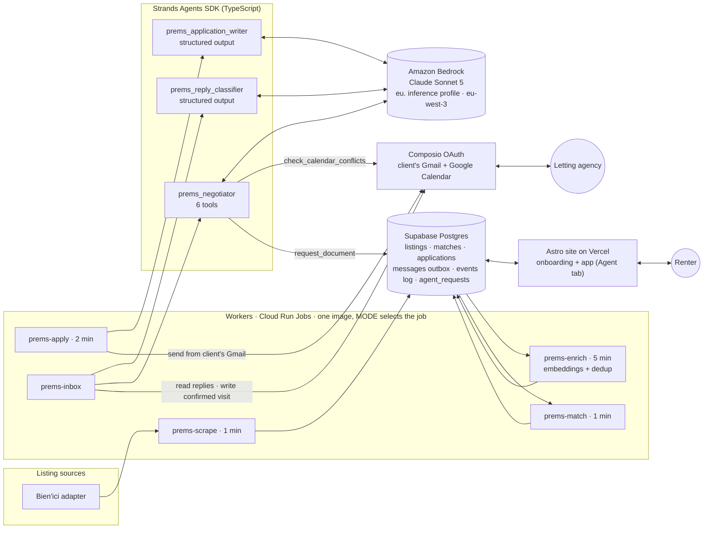

# Prems

**An agent that applies to rental listings for you, answers the letting agency, and books the viewing: from your own mailbox, while you sleep.**

Built with the **[Strands Agents SDK](https://strandsagents.com)** (TypeScript) on **Claude Sonnet 5 via Amazon Bedrock**.
Submitted to the **AWS _Agents for Humans_ hackathon: Everyday Agents track.**

[](LICENSE)


Live site: **https://prems.getmira.run** · Hackathon write-up: [`docs/HACKATHON.md`](docs/HACKATHON.md) · Architecture (FR): [`docs/ARCHITECTURE.md`](docs/ARCHITECTURE.md) · Operations (FR): [`docs/RUNBOOK.md`](docs/RUNBOOK.md)

---

## The problem

In Paris a good apartment is gone within a day, and the queue is ordered by who answered first.
Applying means doing the same things over and over:

- opening a portal;
- retyping the same twelve facts about yourself;
- writing a message that doesn't read like a template;
- doing it forty times;
- then watching your inbox, because a reply has to be answered within the hour to keep your place.

None of that takes judgment. It is latency, repetition, and being awake at the right moment.

**Who it's for:** renters in tight urban markets, starting with Paris. That means students, young workers and anyone moving for a job, who cannot spend their evenings refreshing listing sites.

**Why it matters:** finding a home is the most stressful routine task most people face. The people who lose out are those with the least free time, not the weakest applications.

## What the agent does, end to end

1. **Finds** a matching listing within a minute of publication (scraper + vector matching on your saved search).
2. **Writes and sends the application** from **your own Gmail**, with your name on it, citing the actual apartment, your situation and your income ratio.
3. **Reads the agency's reply** in your inbox and classifies it: `visit_offered`, `visit_confirmed`, `question`, `refused` or `other`.
4. **Negotiates** the viewing slot:
   - reads the availability you saved;
   - checks your **real Google Calendar** for conflicts;
   - answers with a slot you can actually keep;
   - asks *you* for any document the agency requested that isn't in your file.
5. **Books it**: a confirmed visit is written to your Google Calendar and appears in the app's *Agent* tab.

Every decision is logged with the tools the agent called, so *"why did it propose Tuesday?"* has an answer.

## Architecture



A French poster version of the same architecture is in [`docs/architecture.svg`](docs/architecture.svg).

## The agents, on Strands

All three agents are built with `@strands-agents/sdk` and run on Claude through `BedrockModel`. The model, region and credentials are named in exactly one file, [`workers/src/agent.ts`](workers/src/agent.ts).

| Agent | File | Tools | What it decides |
|---|---|---|---|
| `prems_application_writer` | [`workers/src/draft.ts`](workers/src/draft.ts) | none, `structuredOutputSchema` | The subject and text of the application |
| `prems_reply_classifier` | [`workers/src/inbox.ts`](workers/src/inbox.ts) | none, `structuredOutputSchema` | What the agency just said, and the visit date if any |
| `prems_negotiator` | [`workers/src/negotiate.ts`](workers/src/negotiate.ts) | **6** | Whether to reply, with which slot, and what to ask the client for |

**Two of them have no tools, and that is a decision.** Writing an application from facts already gathered, or sorting a message into five categories, is not an errand. Their answer is validated against a zod schema through Strands' structured output, not requested in prose.

**The negotiator is a real tool-using agent.** It is rebuilt for every thread, because its tools close over *this* client and *this* listing:

| Tool | What it does |
|---|---|
| `get_client_availability` | Returns the slots the client saved, or tells the agent to ask the agency to propose one. |
| `check_calendar_conflicts` | **Reads the client's real Google Calendar.** For each slot the agency proposed, it says whether the slot is free or clashes, and with what. If the calendar can't be read, it says so instead of reporting an empty diary. |
| `get_client_facts` | Returns what is known about the candidate. An absent field is information we don't have and must not be written. |
| `request_document` | Records what the agency asked for and the client doesn't have, so it appears in the Agent tab next to an upload button. |
| `queue_reply` | Queues the message. Idempotent: a second call is refused. |
| `stand_down` | Sends nothing, and says why. |

```ts
// workers/src/negotiate.ts (abridged)
const checkConflicts = tool({
  name: 'check_calendar_conflicts',
  description: "Lit l'agenda réel du candidat et dit, pour chaque créneau proposé, s'il est libre ou occupé.",
  inputSchema: z.object({ slots: z.array(z.object({ startISO: z.string(), durationMinutes: z.number(), label: z.string() })) }),
  callback: async ({ slots }) => { /* Google Calendar via Composio, overlap computed in code */ },
});

return new Agent({
  name: 'prems_negotiator',
  model: bedrock(),                       // BedrockModel, Claude Sonnet 5
  systemPrompt: NEGOTIATOR_INSTRUCTION,
  tools: [getAvailability, checkConflicts, getFacts, requestDocument, queueReply, standDown],
  printer: false,
});
```

This is what turns a one-way booking into a negotiation. The agency writes *"mardi 14h ou jeudi 10h ?"*. The agent reads the diary, finds Tuesday taken, and answers *"mardi je ne suis pas disponible, jeudi 10h me convient"*. It needs no human for that, and it never proposes a slot it did not check.

Agent prompts and outgoing e-mails are in French, the language of the market.

### Guardrails live in code, not in the prompt

A rule a model can talk itself out of is not a rule. These checks sit around the Strands agent in `writeReply` and `maybeReply`:

- **A refusal ends the thread** before any agent is built.
- **Limits:** the per-thread reply cap and the operator kill switch are read from the `settings` table and checked before the agent runs.
- **Availability must be read:** if the client had saved availability and the agent never called the tool that returns it, its message is replaced by a plain, safe reply.
- **No invented dates:** a calendar date written for a client with no availability, and without a calendar check, is refused.
- **Silence must be explicit:** an empty turn does not count as choosing silence; only `stand_down` does.
- **Nothing is sent from inside the agent.** `queue_reply` hands the text back to the caller, which writes it to the same `messages` outbox the client's own replies use.

All of these are pinned by tests that replay a script of tool calls against the **real Strands tools**, with no model involved: [`workers/test/negotiate.test.ts`](workers/test/negotiate.test.ts).

### Amazon Bedrock

| Setting | Default | Why |
|---|---|---|
| `BEDROCK_MODEL_ID` | `eu.anthropic.claude-sonnet-5` | The prompts carry a named person's income, availability and private correspondence. The `eu.` inference profile keeps inference in European regions. |
| `AWS_REGION` | `eu-west-3` (Paris) | The same city as the users. |
| Credentials | AWS SDK default chain | An IAM role where attached; otherwise `AWS_ACCESS_KEY_ID` / `AWS_SECRET_ACCESS_KEY` from a secret manager. |

`npm run bedrock:models` runs one real Strands turn per candidate model ID, from your account and region, and tells you which ones answer.

## Running it

Requires Node 22+.

```bash
git clone https://github.com/chessoren/prems-agent
cd prems-agent
npm install
cp .env.example .env        # then fill it in: see the comments in the file
```

**Checks** (the same ones CI runs, no cloud account needed):

```bash
npm run ci                  # typecheck + 63 tests + site build
```

**The site and the onboarding flow:**

```bash
npm run dev                 # http://localhost:4321
```

**The database**, against your own Supabase project:

```bash
npm run db:provision        # schema, RLS, buckets (idempotent)
npm run db:migrate          # supabase/migrations
npm run db:seed             # demo listings
```

**The agents**, against your own AWS account with Bedrock model access for Anthropic models:

```bash
npm run bedrock:models      # which Claude model IDs answer from this account/region
npx tsc -b workers
MODE=apply  node --env-file=.env workers/dist/index.js   # write + send applications (writer agent)
MODE=inbox  node --env-file=.env workers/dist/index.js   # read replies, classify, negotiate
MODE=demo   node --env-file=.env workers/dist/index.js   # the whole cycle every 8 s, for a live demo
```

**A reproducible end-to-end demo.** The product can only be filmed end to end if an agency replies. This seeds one listing addressed to a mailbox you control, so you can play both roles:

```bash
npm run db:demo -- --account you@example.com --agency your-other@example.com
MODE=demo DEMO_AGENCY_EMAIL=your-other@example.com node --env-file=.env workers/dist/index.js
npm run db:demo -- --remove
```

The agent is told nothing: same table, same filter, same score, same send path.

## Deploying

The workers are one Docker image ([`workers/Dockerfile`](workers/Dockerfile)) run as scheduled jobs. [`workers/cloudbuild.yaml`](workers/cloudbuild.yaml) builds and deploys a job. The two jobs that call agents need Bedrock credentials:

```bash
printf %s "$AWS_ACCESS_KEY_ID"     | gcloud secrets create aws-access-key-id --data-file=-
printf %s "$AWS_SECRET_ACCESS_KEY" | gcloud secrets create aws-secret-access-key --data-file=-
for JOB in prems-apply prems-inbox; do
  gcloud run jobs update $JOB --region=europe-west9 \
    --update-env-vars=AWS_REGION=eu-west-3,BEDROCK_MODEL_ID=eu.anthropic.claude-sonnet-5 \
    --update-secrets=AWS_ACCESS_KEY_ID=aws-access-key-id:latest,AWS_SECRET_ACCESS_KEY=aws-secret-access-key:latest
done
npm run preflight           # checks every link of the chain, including Bedrock credentials on each job
```

The image is generic Node 22 and has no Google-specific runtime dependency on the agent path. It runs unchanged on ECS Fargate scheduled tasks with an IAM role instead of keys.

## What does not work yet

Stated here rather than discovered by a reader.

- **No real client has connected a mailbox yet.** The Gmail/Calendar consent flow, the edge function and the workers are in place. What's missing is a person clicking through Google's consent screen. The demo mode above is how the full loop is shown.
- **Bedrock was wired on 14 September and has not run in production yet.** The pipeline ran on Google's ADK with Gemini until that day. The deployed jobs pick up Strands + Bedrock once they are redeployed with AWS credentials (see *Deploying*).
- **Embeddings still come from Vertex AI.** `text-multilingual-embedding-002` (768 dimensions) produced every vector in the catalogue. Moving to Titan or Cohere embeddings means a migration and a full re-embed. No agent decision depends on it.
- **Amazon Bedrock AgentCore is not used.** The agents run inside batch jobs that already have a schedule, a timeout and an outbox. AgentCore Runtime is the natural next step for an interactive, per-user agent.
- **Coverage is limited.**
  - One listing source: sites behind anti-bot protection (LeBonCoin, SeLoger, PAP) are not connected.
  - Only 10–18% of listings expose a reachable agency e-mail address.

## Provenance and disclosure

- **Pre-existing work.**
  - The marketing landing page and legal pages are generated from our own Framer site, `prems.framer.ai`, by the pipeline in [`docs/FRAMER-CLONE.md`](docs/FRAMER-CLONE.md). The first commits (9 August 2026, before the submission period opened) are that clone.
  - Everything under `workers/`, `packages/`, `services/`, `supabase/` and `tools/` was written for this project from 10 August onwards. The full git history is kept so the timeline can be checked.
- **Agent framework history.** The three agents were first built on Google's Agent Development Kit with Gemini. On 14 September they were ported to the **Strands Agents SDK on Amazon Bedrock**. The tools, schemas, prompts and guardrails carried over; the runtime, model and tests' agent harness were rewritten.
- **AI coding assistants.** Most commits were written with Claude Code, which is why many are authored by "Claude".
- **Third-party services**, used under their own terms: Amazon Bedrock, Supabase, Vercel, Composio, Google Cloud (Cloud Run, Vertex AI embeddings, Document AI OCR), Stripe (payments currently switched off).
- **The listing source.** `prems-scrape-bienici` reads public listing pages at a deliberately low rate, behind a pluggable adapter ([`workers/src/adapters/registry.ts`](workers/src/adapters/registry.ts)).

## Repository map

| Path | What |
|---|---|
| `workers/` | The pipeline and the three Strands agents (TypeScript, one image, `MODE` selects the job) |
| `packages/core/` | Pure matching and de-duplication logic |
| `supabase/` | SQL migrations (RLS everywhere) and edge functions (mailbox connection, Stripe webhook) |
| `src/` | Astro site: landing page, onboarding, and the app with the Agent tab |
| `services/prems-api/` | Document OCR service for the applicant's file |
| `tools/` | Provisioning, preflight, `bedrock-models` probe, screenshot tools |
| `docs/` | Detailed architecture, status and runbook (in French) |

## License

[MIT](LICENSE)
