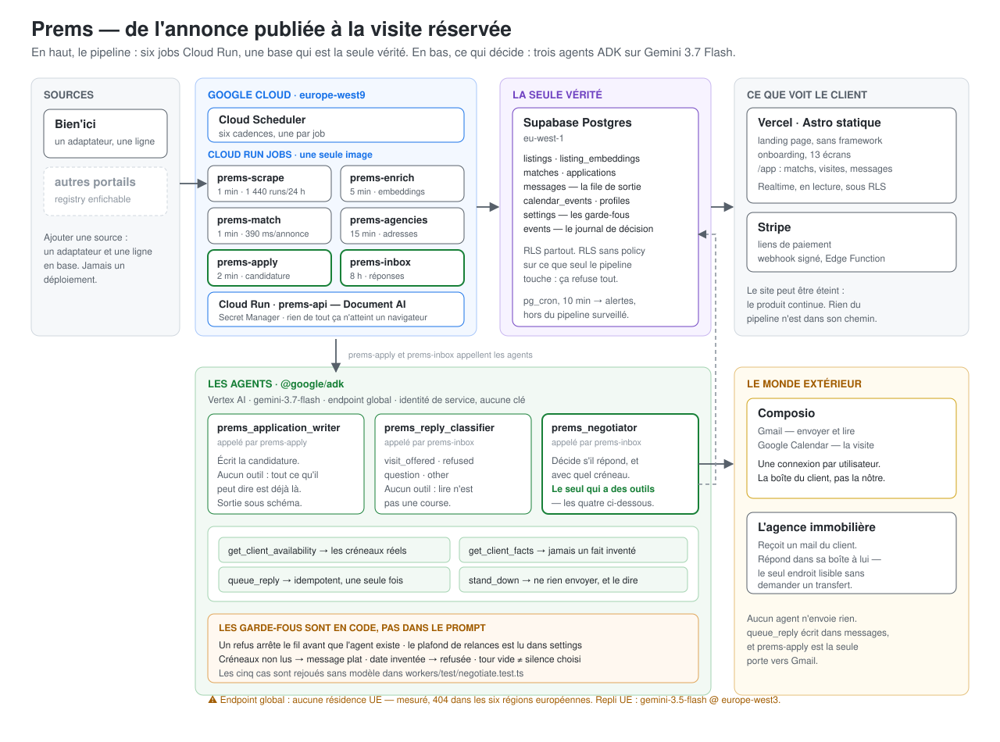

# Prems

**An agent that applies to rental listings for you, answers the agency, and books the viewing — from your own mailbox, while you are asleep.**

Live: **https://prems.getmira.run** · Architecture: [`docs/ARCHITECTURE.md`](docs/ARCHITECTURE.md) · Operations: [`docs/RUNBOOK.md`](docs/RUNBOOK.md) · Measured state: [`docs/STATUS.md`](docs/STATUS.md)

---

## The friction

In Paris a good apartment is gone in a day. The rest of the market is a queue,
and the queue is ordered by who answered first. Applying means opening a portal
you have an account on, retyping the same twelve facts about yourself, writing a
message that does not read like a template, and doing it again forty times —
then watching a mailbox for replies you must answer within the hour to keep your
place.

None of that is judgement. It is latency, repetition, and being awake at the
right moment. Prems removes it: the listing is found within a minute of being
published, the application goes out from **the client's own Gmail** with their
name on it, the reply lands in **their own inbox**, and the agent answers it
with a slot they can actually keep.

## What runs, unattended

Six Cloud Run Jobs, one image, `europe-west9`. Nothing here is on the website's
critical path — the site can be switched off and the product keeps working.

| Job | Cadence | State |
|---|---|---|
| `prems-scrape-bienici` | 1 min | **1 440 runs / 24 h, 0 failures** |
| `prems-enrich` | 5 min | embeddings + de-duplication |
| `prems-match` | 1 min | ~390 ms per listing |
| `prems-agencies` | 15 min | resolves agency addresses |
| `prems-apply` | 2 min | writes and queues the application |
| `prems-inbox` | 8 h | reads replies, classifies, negotiates |

```
815 listings   146 reachable (17.9%)   737 matches   0 in DLQ
1 440 runs/24h   0 failures            59 tests      CI green
```

Coverage is measured **against the source**, not inferred from green logs:
41 listings out of 41 over 51 hours, checked by querying Bien'ici directly and
diffing identifiers against the database. `1 440 runs, 0 failures` says the
scraper ran; it does not say it found everything. See [`docs/STATUS.md`](docs/STATUS.md)
for the two honest caveats on that number.

## Architecture



## The agents

Three, all on `gemini-3.7-flash` through Vertex AI, built with the
**Agent Development Kit** (`@google/adk`). The model and its authentication are
named in exactly one file, [`workers/src/agent.ts`](workers/src/agent.ts).

| Agent | Where | Tools | What it decides |
|---|---|---|---|
| `prems_application_writer` | `workers/src/draft.ts` | none | The text of the application |
| `prems_reply_classifier` | `workers/src/inbox.ts` | none | What the agency just said |
| `prems_negotiator` | `workers/src/negotiate.ts` | 6 | Whether to reply, with which slot, and what to ask the client for |

**Two of them have no tools, and that is a decision.** Writing an application
from facts already gathered, or sorting a message into four categories, is not
an errand. Their output is constrained by a response schema rather than
requested in prose: "answer in strict JSON" was an instruction the model could
ignore; an `outputSchema` is a constraint the API enforces.

**The negotiator has four, and that is what changed.** Availability used to be
interpolated into its prompt, which meant a model that ignored it produced a
plausible sentence naming a day nobody was free — and nothing downstream could
tell that apart from a real proposal.

| Tool | Returns |
|---|---|
| `get_client_availability` | The saved slots, or the instruction to ask the agency instead |
| `check_calendar_conflicts` | **Reads the client's real Google Calendar.** Given the slots the agency proposed, says which are free and which clash, and with what. When the calendar cannot be read it says so rather than reporting an empty diary — an agent told "nothing is booked" by a failed lookup accepts a viewing the client cannot attend |
| `get_client_facts` | What is known about the candidate — an absent field is information we do not have |
| `request_document` | Records what the agency asked for and the client does not have, so it appears in the Agent tab with an upload next to it. Before this existed the agent wrote "je vous le transmets dans la journée" and nobody was ever told |
| `queue_reply` | Queues the message. Idempotent: a second call is refused, not applied |
| `stand_down` | Send nothing, and say why |

This is what turns a one-way booking into a negotiation. The agency writes
*"mardi 14h ou jeudi 10h ?"*; the agent reads the diary, finds the Tuesday
taken, and answers *"mardi je ne suis pas disponible, jeudi 10h me convient"* —
without asking anyone, and without ever proposing a slot it did not check.

Which tools were actually called is written to `events` next to the message
produced, so *"why did it propose Tuesday?"* has an answer that is not a guess
about what the model was thinking.

### The guardrails are in code, not in the prompt

A rule a model can talk itself out of is not a rule.

- A refusal ends the thread **before the agent is built**.
- The per-thread reply cap and the operator kill switch are read from `settings`,
  in the database, and checked upstream.
- If the client had availability and the agent never called the tool that
  returns it, the message is replaced by the plain one — whatever it wrote about
  dates, it did not read them here.
- A calendar date invented for a client with no availability is refused.
- An empty turn is not chosen silence. Only `stand_down` is.

All five are pinned by tests that replay a script of tool calls against the real
tools, with no model involved: [`workers/test/negotiate.test.ts`](workers/test/negotiate.test.ts).

**No agent sends anything.** `queue_reply` hands the text back to the caller,
which writes it to `messages` — the same outbox a client's own replies go
through. One way out of this system, one place a send can fail.

## Google standards, named

| Standard | Where it is used |
|---|---|
| **Gemini Function Calling** | The negotiator declares six tools and the model chooses between them each turn — `workers/src/negotiate.ts`. Declared through the ADK's `FunctionTool`, which compiles a zod schema into a Gemini function declaration; the model's choice and its arguments are validated before anything runs. |
| **Agent Development Kit** (`@google/adk` 2.0) | The three agents, their runner, their sessions and their tool loop. |
| **GenAI SDK** (`@google/genai`) | Embeddings, and the transport underneath the ADK. |
| **Structured output** | The application writer and the reply classifier answer against a response schema, so malformed JSON is not one of the ways they fail. |
| **Google Workspace — Gmail API** | Applications leave from the client's own mailbox and replies are read there. Per-user OAuth, brokered by Composio. |
| **Google Workspace — Google Calendar API** | Read *and* write. The agent reads the client's real calendar to rule out a slot it cannot keep, and writes the confirmed viewing back. |
| **Vertex AI** | `gemini-3.7-flash` for the agents, `text-multilingual-embedding-002` for the catalogue. |
| **Document AI** | ID documents and payslips, EU multi-region processors. |
| **Cloud Run Jobs** | The six workers. One image; `MODE` selects the job. |
| **Cloud Run** | `prems-api`, the only service holding secrets. |
| **Cloud Functions** (Supabase Edge) | `connect-mailbox` and the Stripe webhook — the two callbacks that must not run in a browser. |
| **Cloud Scheduler** | Six cadences, one per job. |
| **Secret Manager**, **Artifact Registry**, **Cloud Build** | Credentials, images, and the one file that is the whole deployment. |

## Google Cloud

| Service | Used for |
|---|---|
| Cloud Run Jobs | The six workers. One image; `MODE` selects the job |
| Cloud Run | `prems-api` — document OCR, the only service holding secrets |
| Cloud Scheduler | Six cadences, one per job |
| Vertex AI | `gemini-3.7-flash` (global endpoint) and `text-multilingual-embedding-002` (`europe-west9`) — both verified against the live API |
| Document AI | ID documents and payslips, EU multi-region processors |
| Secret Manager | Service-role and API keys, mounted at run time |
| Artifact Registry + Cloud Build | `workers/cloudbuild.yaml` is the whole deployment |

No JSON key ships in any container: Cloud Run gives the workload its identity,
and the SDK picks it up as Application Default Credentials.

Data outside Google Cloud: Supabase Postgres (`eu-west-1`) is the single source
of truth, Vercel serves the static site, Composio brokers the client's Gmail and
Calendar, Stripe takes the payment.

## Running it

```bash
git clone https://github.com/chessoren/prems-landing-page
cd prems-landing-page
npm install
cp .env.example .env        # then fill it in — see the comments in the file
```

**The site and the onboarding flow** need nothing else:

```bash
npm run dev                 # http://localhost:4321
npm run build               # dist/ — static files, hostable anywhere
```

**The database**, against your own Supabase project:

```bash
npm run db:provision        # schema, RLS, buckets — idempotent
npm run db:migrate          # migrations in supabase/migrations — 0017 adds the
                            # agent_requests table and the agent_activity view
                            # the Agent tab reads
npm run db:seed             # 1 100 demo listings across 11 cities
npm run db:inspect          # what is actually in there
```

**The workers**, against your own Google Cloud project. They need
`GCP_PROJECT_ID`, credentials (`gcloud auth application-default login`, or
`GOOGLE_APPLICATION_CREDENTIALS`), and the Vertex AI API enabled:

```bash
npx tsc -b workers
MODE=enrich   node workers/dist/index.js    # embeddings and duplicate links
MODE=match    node workers/dist/index.js    # matching and fairness
MODE=apply    node workers/dist/index.js    # write and queue applications
MODE=inbox    node workers/dist/index.js    # read replies, classify, negotiate
MODE=agencies node workers/dist/index.js    # resolve agency e-mail addresses
SOURCE_SLUG=bienici node workers/dist/index.js   # scrape one source
```

**Deploying the workers** — one file is the whole deployment, and
`jobs deploy` creates or updates:

```bash
gcloud builds submit --config workers/cloudbuild.yaml \
  --substitutions=_JOB=prems-scrape-bienici,_SOURCE_SLUG=bienici
```

Full first-run procedure, IAM roles and the checks to run before deploying:
[`docs/DEMARRAGE.md`](docs/DEMARRAGE.md) and [`docs/RUNBOOK.md`](docs/RUNBOOK.md).

**Checks**, the same ones CI runs:

```bash
npm run ci                  # typecheck + tests + build
npm run gcp:models          # which model answers, from which region
npm run preflight           # is the product actually armed, link by link
```

## What does not work yet

Stated here rather than discovered by a reader, because the gap is the
interesting part.

- **No client has connected a mailbox yet — and no code is missing for it.**
  The button, the browser call, the deployed edge function and the workers that
  read `profiles.gmail_account_id` are all in place; `npm run preflight` checks
  each link and names the one that fails. What is missing is a person clicking
  through Google's consent screen, which no amount of server access replaces.
  Until then `prems-apply` queues and `prems-inbox` has never run against a real
  inbox — the one thing between the pipeline and an end-to-end demonstration.
- **Reachability is 10–18%.** Bien'ici publishes a phone number and withholds
  the e-mail; the form behind an account *is* their product. `prems-agencies`
  resolves an address per agency to cover the rest, and it is still running its
  first pass.
- **One source.** The sites behind anti-bot (LeBonCoin, SeLoger, PAP) wait on a
  proxy purchase. Adding a source is an adapter plus a row in `sources` — never
  a deployment.
- **The model runs on the global endpoint, so there is no EU data residency.**
  Measured, not assumed: `gemini-3.7-flash` answers from `global` and 404s in
  all six European regions tried. The prompts carry a named person's income,
  availability and private correspondence. The EU-resident fallback is
  `GCP_MODEL=gemini-3.5-flash GCP_MODEL_LOCATION=europe-west3` (Frankfurt, the
  only European region serving a 3.x model) — two variables, no code, no
  redeploy. A decision to take deliberately before the first paying client, not
  a detail. Full matrix in [`docs/RUNBOOK.md`](docs/RUNBOOK.md), §4.

## Provenance

- **Pre-existing work.** The landing page and the legal pages are generated from
  our own Framer site, `prems.framer.ai`, by the pipeline described in
  [`docs/FRAMER-CLONE.md`](docs/FRAMER-CLONE.md). The design is ours; the
  generated markup, the vendored fonts and the images under `public/assets/`
  come from that export and are not hand-written. The generator rewrites the
  vendor's class prefix and attribute names on the way out — verified by pixel
  diff, not assumed — so the delivered markup reads as this project's own, but
  the provenance is stated here rather than hidden. Everything under `workers/`,
  `packages/`, `services/`, `supabase/` and `tools/` is written for this project.
- **Third-party services** are used under their own terms: Supabase, Vercel,
  Composio, Stripe, and Google Cloud.
- **The listing source.** `prems-scrape-bienici` reads public listing pages at a
  deliberately low rate. The adapter is one implementation behind
  `workers/src/adapters/registry.ts`; an official feed or a partner API is a
  drop-in replacement, and the rest of the system does not know the difference.

## Documentation

Written in French, which is the language of the team and of the market.

| | |
|---|---|
| [`docs/ARCHITECTURE.md`](docs/ARCHITECTURE.md) | How it is built, and what each decision cost |
| [`docs/STATUS.md`](docs/STATUS.md) | What runs, measured — read this first |
| [`docs/RUNBOOK.md`](docs/RUNBOOK.md) | How to operate it, and every failure already met |
| [`docs/DEMARRAGE.md`](docs/DEMARRAGE.md) | First-run procedure |
| [`docs/APP.md`](docs/APP.md) · [`docs/ONBOARDING.md`](docs/ONBOARDING.md) · [`docs/FRONTEND.md`](docs/FRONTEND.md) | The client-facing surfaces |
| [`docs/CLOUD-RUN.md`](docs/CLOUD-RUN.md) | The OCR service and its deployment |
| [`docs/FRAMER-CLONE.md`](docs/FRAMER-CLONE.md) | How the marketing pages are regenerated |
